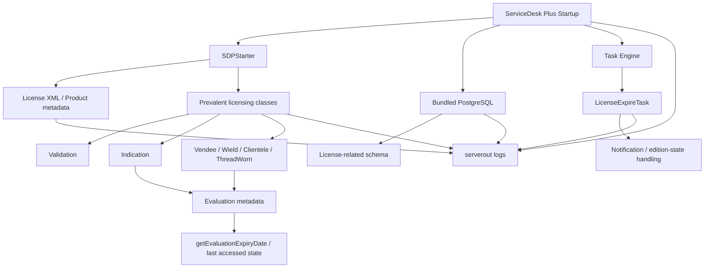

# ManageEngine ServiceDesk Plus — Licensing Principles Research

> [!IMPORTANT]
> **EDUCATIONAL & DEFENSIVE RESEARCH ONLY**  
> Bu depo, ManageEngine ServiceDesk Plus'ın lisanslama mimarisini **eğitim, yazılım mimarisi öğrenimi, gözlemlenebilirlik ve savunmacı güvenlik araştırması** amacıyla inceleyen bağımsız bir çalışma günlüğüdür. Amaç lisans kontrollerini atlatmak, ücretli özellikleri yetkisiz kullanmak, lisans dosyalarını değiştirmek veya üretici korumalarını etkisizleştirmek değildir.

> [!WARNING]
> Depoda üreticiye ait lisans anahtarları, özel binary/JAR dosyaları, tam decompile çıktıları, kimlik bilgileri veya lisans mekanizmasını değiştiren/bypass eden kodlar yayımlanmaz. İncelemeler mümkün olduğunca **read-only** gözlem, log analizi, metadata, hash, SQL telemetry ve bytecode çağrı ilişkileri üzerinden belgelenir.

## Projenin amacı

Bu araştırmanın temel sorusu şudur:

**ServiceDesk Plus, evaluation/lisans durumunu hangi katmanlarda saklıyor, okuyor ve uygulama davranışına nasıl yansıtıyor?**

Çalışma; veritabanı, dosya sistemi, uygulama logları, Java bytecode çağrıları ve zamanlanmış görevler arasında lisanslama ile ilişkili veri akışını anlamaya odaklanır. Bulgular "kesin", "güçlü gösterge" ve "hipotez" olarak ayrılır; tek bir string veya tablo adı, tek başına lisans karar noktası kabul edilmez.

## Şu ana kadarki ana bulgular

- Uygulamanın bundled PostgreSQL altyapısı **PostgreSQL 15.14 / 64-bit** olarak gözlemlendi.
- ServiceDesk veritabanına lokal bağlantı zincirinde `localhost:65432/servicedesk` ve uygulama tarafında `sdpadmin` kullanıcısı görüldü.
- `licensekey`, `license_upgrade`, `licenseagreement`, `licenseorderhistory` ve reklam/promosyon odaklı bazı lisans tabloları incelendi. İlk gözlemlerde temel lisans tablolarının boş olması, evaluation durumunun yalnızca bu tablolara dayanmadığını düşündürdü.
- `licensekey` şemasında `license_type`, `no_of_users`, `no_of_ws`, `expiry_date`, `org_id`, `instance_id` gibi lisans metadata alanları tespit edildi.
- Uygulama loglarında `LicenseExpireTask` çalışması ve `licenseTo : Evaluation User` kayıtları görüldü.
- Dosya sisteminde `AdventNetLicense.xml`, `ExpiredLicense.xml`, `petinfo.dat` ve `product.dat` dosyaları gözlemlendi.
- Bir ölçümde `AdventNetLicense.xml` ile `ExpiredLicense.xml` aynı SHA-256 değerini verdi; bu durum iki dosyanın o anda byte-for-byte aynı olduğunu gösterdi, ancak tek başına karar mekanizmasını kanıtlamaz.
- Java bytecode incelemelerinde `Indication`, `Vendee`, `Wield`, `Validation`, `Clientele`, `ThreadWorn`, `SDPStarter` ve `LicenseExpire/LicenseExpireTask` sınıfları lisans/evaluation akışında tekrar tekrar görüldü.
- `Vendee` tarafında `lastAccessedString` ve `expiryDate`; `Indication` tarafında `evalExpiryDate`; üst katmanlarda `getEvaluationExpiryDate()` çağrıları gözlemlendi.
- `SDPStarter`, lisans XML içinden `User.getExpiryDate()` ve `User.getLicenseType()` çağrılarını kullanıyor; `Evaluation` kontrolü ile dosya hazırlama/kopyalama davranışlarının aynı başlangıç akışında yer aldığı görüldü.

## Araştırma topolojisi

```text
ManageEngine-Service-Desk-Plus-Licensing-Principles/
├── README.md
├── SECURITY.md
├── docs/
│   ├── 00-scope-and-ethics.md
│   ├── 01-environment.md
│   ├── 02-research-topology.md
│   ├── 03-postgresql-observations.md
│   ├── 04-java-license-flow.md
│   ├── 05-file-and-log-observations.md
│   ├── 06-findings-matrix.md
│   ├── 07-research-timeline.md
│   └── 08-next-steps.md
├── evidence/
│   └── README.md
└── queries/
    ├── postgres-observation.sql
    └── powershell-readonly-observation.ps1
```

## Katmanlar arası çalışma modeli



Bu diyagram **gözlenen çağrı ve veri yüzeylerini** gösterir; her ok, kriptografik doğrulama veya nihai lisans kararı anlamına gelmez.

## Metodoloji

Araştırmada şu prensipler izlenir:

1. Önce dosya, tablo, sınıf ve log yüzeyleri envanterlenir.
2. Hash ve timestamp ile dosya değişimleri korele edilir.
3. PostgreSQL tarafında read-only sorgular ve `pg_stat_statements` gibi telemetry kaynakları kullanılır.
4. Java tarafında sınıf isimleri, method imzaları ve çağrı grafiği incelenir; üretici kodu yeniden dağıtılmaz.
5. Startup öncesi/sonrası log ve sorgu farkları karşılaştırılır.
6. Her bulgu "kanıt", "yorum" ve "sonraki test" olarak ayrılır.
7. Lisans durumunu değiştiren patch, DB update, binary edit, clock tampering veya signature bypass bu deponun kapsamı dışındadır.

## Hızlı başlangıç

Önce şu dosyaları okuyun:

- [`docs/00-scope-and-ethics.md`](docs/00-scope-and-ethics.md) — kapsam ve sınırlar
- [`docs/02-research-topology.md`](docs/02-research-topology.md) — bileşen haritası
- [`docs/06-findings-matrix.md`](docs/06-findings-matrix.md) — hangi bulgunun ne kadar güçlü olduğu
- [`docs/08-next-steps.md`](docs/08-next-steps.md) — sıradaki güvenli araştırma adımları

Read-only gözlem komutları:

- [`queries/postgres-observation.sql`](queries/postgres-observation.sql)
- [`queries/powershell-readonly-observation.ps1`](queries/powershell-readonly-observation.ps1)

## Araştırma durumu

**Durum:** Aktif / devam ediyor  
**Son dokümantasyon güncellemesi:** 10 Eylül 2026

Şu anki en güçlü çalışma modeli, evaluation bilgisinin tek bir SQL satırından ziyade **dosya tabanlı ürün/lisans metadata + Prevalent Java sınıfları + runtime task/log katmanı** arasında işlendiği yönündedir. PostgreSQL tarafındaki lisans tabloları ürünün genel lisans envanterinin parçasıdır; fakat mevcut gözlemler evaluation expiry kararının yalnızca bu tablolardan türediğini göstermemektedir.

## Hukuki ve marka notu

ManageEngine ve ServiceDesk Plus, ilgili sahiplerinin ticari markalarıdır. Bu depo ManageEngine/Zoho tarafından oluşturulmamış, desteklenmemiş veya onaylanmamıştır. Araştırma yalnızca yetkili olunan test ortamlarında yapılmalıdır.
