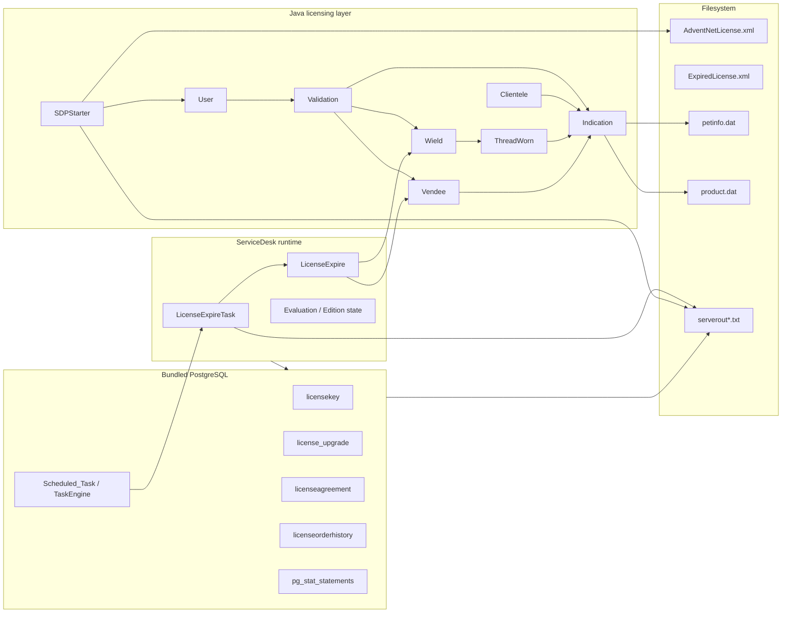

# 02 — Research Topology

## High-level component map



## Interpretation

The topology intentionally separates four evidence planes:

1. **Filesystem plane** — license/product metadata and runtime artifacts.
2. **Java plane** — parsing, validation, evaluation-date accessors and startup logic.
3. **Runtime/task plane** — expiry task execution and application behavior.
4. **Database plane** — schema, persisted license-related business data and query telemetry.

The central research mistake to avoid is assuming that a table or filename containing the word `license` is necessarily the authoritative enforcement point.

## Observed relationships

### Startup

`SDPStarter` was observed reading a license data structure and calling methods equivalent to:

```text
User.getExpiryDate()
User.getLicenseType()
```

A branch comparing the license type with `Evaluation` was present in the same startup routine.

### Persisted evaluation metadata

`Indication` exposes evaluation-related state including an `evalExpiryDate` field. Other classes deserialize/read this state and invoke evaluation-expiry accessors.

### Runtime expiry handling

`LicenseExpireTask` exists as a TaskEngine task and logs that it is executing a license-expire notification. This is evidence of a scheduled/runtime expiry workflow, but notification logic should not automatically be equated with the original validation decision.

### Database

The database contains product/business licensing tables such as `licensekey` and `licenseagreement`, while task tables schedule runtime jobs. Query telemetry was used to determine which tables are actually accessed during observation windows.

## Working model

```text
Product/license files
        │
        ▼
Prevalent parsing + persisted indication state
        │
        ├──► startup checks
        │
        ├──► evaluation-date accessors
        │
        └──► runtime expiry logic
                    │
                    ▼
            scheduled ServiceDesk task

Bundled PostgreSQL ──► product/business license state + runtime/task persistence + telemetry
```

**Current confidence:** strong indicator. The exact final enforcement boundary has not been reduced to one authoritative function and may intentionally span multiple layers.
