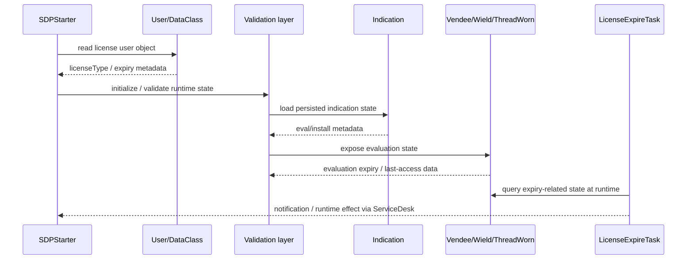

# 04 — Java License Flow

## Purpose of the Java phase

After the database phase failed to expose a single populated evaluation-expiry row, the investigation moved upward into the application's Java layer. The goal was not to reproduce proprietary source code, but to map **class names, method signatures, fields and call relationships** visible in bytecode/decompiler output.

## Repeatedly observed licensing classes

```text
com.adventnet.tools.prevalent.Indication
com.adventnet.tools.prevalent.Vendee
com.adventnet.tools.prevalent.Wield
com.adventnet.tools.prevalent.Validation
com.adventnet.tools.prevalent.Clientele
com.adventnet.tools.prevalent.ThreadWorn
com.adventnet.tools.prevalent.User
```

ServiceDesk-specific classes also appeared:

```text
com.adventnet.servicedesk.task.LicenseExpire
com.adventnet.servicedesk.task.LicenseExpireTask
SDPStarter
```

## `Indication`

The `Indication` class was a central recurring component.

Observed concepts included:

```text
evalExpiryDate
serialize()
deSerialize()
productNameDeSerialize()
addEntry(...)
getEvalExpiryDate()
getInstallationExpiryDate()
getFirstTimeUser()
getTheRegCheck()
```

### Interpretation

`Indication` appears to act as a persistence/metadata bridge for licensing state. Multiple higher-level classes read from it, and some code paths serialize state back through it.

This makes `Indication` a high-value architectural node, but it does **not** by itself establish that one field is sufficient to determine application entitlement.

## `Vendee`

Important fields/methods observed:

```text
lastAccessedString
expiryDate
getTheLastAccessedDate()
getEvaluationExpiryDate()
compareTo(Date, Date)
```

The bytecode showed `getTheLastAccessedDate()` returning `lastAccessedString` and `getEvaluationExpiryDate()` returning an internal `Date` field named `expiryDate`.

### Why this matters

The simultaneous presence of an evaluation expiry date and a last-accessed value suggests the design may consider both **expiry state** and **temporal continuity/last-run state**. That is an architectural observation only; this repository does not attempt to defeat or alter those checks.

## `Wield`, `ThreadWorn`, `Clientele`, `Validation`

These classes repeatedly called or exposed evaluation-related methods.

Observed examples included:

```text
Wield.getEvaluationExpiryDate()
ThreadWorn.getEvaluationExpiryDate()
Clientele.getEvaluationExpiryDate()
Validation.getEvaluationExpiryDate()
```

`ThreadWorn` was seen deserializing `Indication` state before consulting values such as evaluation expiry and installation expiry metadata.

`Validation` participates in higher-level validation flows and is referenced by wrapper/controller classes.

### Architectural takeaway

Evaluation handling is not represented as a single isolated getter. It is distributed across a small graph of objects that:

1. load persisted indication/product state;
2. parse or validate license data;
3. expose evaluation dates and other attributes;
4. surface results to startup/runtime code.

## `SDPStarter`

A particularly useful startup observation was the following logical sequence:

```text
DataClass -> User object
User.getExpiryDate()
User.getLicenseType()
compare license type with "Evaluation"
prepare/copy startup resources
continue ServiceDesk startup
```

The bytecode contained `File.exists()`, `mkdir()` and an internal `copyFile(File, File)` routine in the same broader startup class.

### Important caution

The presence of file-copy operations in `SDPStarter` does not mean every copy operation is license enforcement. The same class also prepares ordinary web resources such as login or WEB-INF files. Calls must be interpreted by control-flow context rather than by proximity alone.

## `LicenseExpireTask`

`LicenseExpireTask` implements the ServiceDesk task interface and obtains a singleton `LicenseExpire` instance.

Observed logging strings include concepts equivalent to:

```text
LicenseExpireTask instantiated
Executing License Expire Notification in thread
LicenseExpireTask ---> executeTask() called
```

This confirms that the application has a scheduled/runtime component specifically dedicated to license-expiration handling or notification.

## Proposed control-flow model



This is a research model, not a claim that every call occurs in exactly this order on every product build.

## Current confidence

| Component | Confidence | Reason |
|---|---|---|
| `Indication` stores evaluation-related metadata | Confirmed | field/method names and serialization calls observed |
| `Vendee` exposes last-access and expiry values | Confirmed | direct field-returning getters observed |
| `SDPStarter` reads license type and expiry | Confirmed | direct `User` method calls observed |
| `LicenseExpireTask` is a scheduled expiry workflow | Confirmed | task implementation and runtime log messages observed |
| Final entitlement is decided by one of these getters alone | Not established | multiple layers participate |
| Evaluation state is multi-source/multi-layer | Strong indicator | DB negative results + file metadata + repeated Java relationships |
